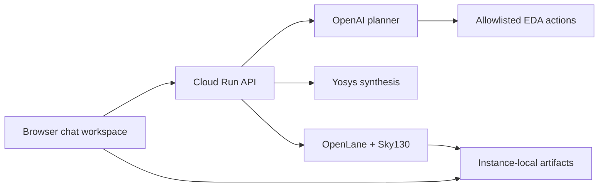
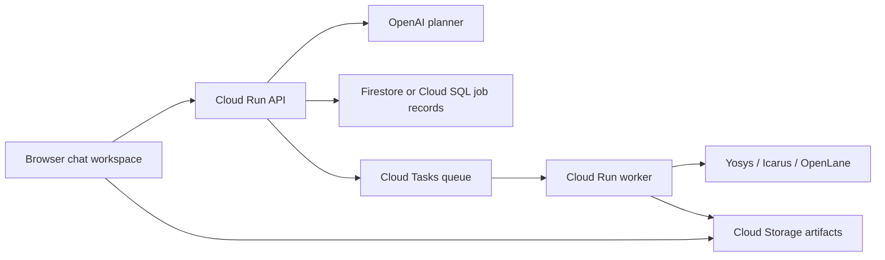

# EDA Copilot

EDA Copilot is a portfolio-grade AI assistant for hardware-design workflows. It keeps the local MCP server for trusted desktop use while adding the shape of a public cloud demo: natural-language planning, allowlisted jobs, status polling, artifacts, and clear security boundaries.

This project began as an open-source fork of `mcp-EDA`, an MCP server inspired by the paper [MCP4EDA: LLM-Powered Model Context Protocol RTL-to-GDSII Automation with Backend Aware Synthesis Optimization](https://arxiv.org/abs/2507.19570). My work extends that foundation into a product-style demo with browser UX, safer cloud architecture, API scaffolding, job lifecycle modeling, and portfolio documentation.

## Original Work Added in This Version

This repository is not just a copy of the original MCP server. I kept attribution to the MCP4EDA-inspired starting point, then added a product and cloud layer around it:

- Built a browser chat workspace with job status, result summaries, artifact browsing, API health, and cloud/local mode awareness.
- Added a Cloud Run API that accepts natural-language EDA prompts, validates requests, creates jobs, polls status, and serves logs/artifacts.
- Added OpenAI-based orchestration for mapping user prompts to allowlisted EDA actions instead of exposing arbitrary shell execution.
- Added LLM-assisted RTL completion for placeholder module skeletons so incomplete examples can become simple synthesizable RTL before tool execution.
- Wired real Yosys synthesis jobs with logs, metrics, synthesized netlists, and result JSON.
- Wired real OpenLane RTL-to-GDS execution in the deployed container, including Sky130 PDK setup through Volare.
- Added artifact collection for GDS, DEF, gate-level Verilog, OpenLane logs, and timing/signoff/routing reports.
- Packaged the system into a Cloud Run-ready Docker image with Node.js, Yosys, OpenLane, and Sky130.
- Deployed the public app to Google Cloud Run and configured OpenAI API access through Google Secret Manager.
- Added smoke tests for the local API, deployed service, real OpenLane flow, and placeholder RTL flow.
- Fixed frontend polling so long-running OpenLane jobs do not appear to fail after transient status checks.
- Documented the implementation and deployment work in [WORK_DONE.md](WORK_DONE.md).

## What It Does

- Runs local MCP tools for Verilog synthesis, Verilog simulation, waveform viewing, OpenLane flows, GDS viewing, and OpenLane report reading.
- Provides a browser-first chat workspace in `index.html` with job status, results, artifact previews, and example prompts.
- Adds a safe cloud API in [src/cloud-api.ts](src/cloud-api.ts) with request validation, structured errors, correlation IDs, rate limiting, allowlisted planner decisions, real Yosys synthesis, and real OpenLane execution when the container includes the OpenLane toolchain and PDK.
- Documents the split between local MCP mode and public cloud demo mode so unrestricted local tools are not exposed on the public web.

## Modes

| Mode | Audience | What Runs | Safety Boundary |
| --- | --- | --- | --- |
| Local MCP mode | Owner/developer in Cursor, Claude Desktop, Codex, or another MCP client | Real local tools such as Yosys, Icarus Verilog, GTKWave, Docker, OpenLane, and KLayout | Trusted local machine only |
| Cloud mode | Public browser users | LLM-orchestrated allowlisted planning, queued jobs, status polling, real Yosys synthesis, and OpenLane execution | No arbitrary shell execution |

## MVP Workflows

- `synthesize_verilog`: queue a Yosys synthesis job, capture logs, and emit a synthesized netlist when Yosys is installed.
- `simulate_verilog`: plan or queue an Icarus Verilog simulation job.
- `summarize_report`: summarize timing, area, power, or OpenLane report text.
- `run_openlane_flow`: run an OpenLane RTL-to-GDSII flow and preserve logs/artifacts.

The current cloud API runs synthesis and OpenLane jobs in the API container. Simulation and report-summary jobs still use async placeholders until those workers are wired to real tools.

## Natural Language Planning

The deployed API calls an OpenAI model when `OPENAI_API_KEY` is configured. The LLM planner classifies the request into one of the supported actions, extracts light parameters such as whether Verilog is present and the top module name, may generate small synthesizable RTL for simple prompts, and rejects unsupported requests.

Without `OPENAI_API_KEY`, local development falls back to a rule-based allowlist planner so the API remains testable offline. The deployed service is expected to run with `OPENAI_API_KEY`.

The LLM planner still returns the same structured decision shape: action, confidence, reason, planner mode, and validated parameters. The executor continues to accept only allowlisted actions.

## Project Structure

```text
eda-copilot/
|-- index.html          # Browser chat/job/results demo
|-- scripts/
|   `-- smoke-api.mjs   # API health, chat, job, and artifact smoke test
|-- src/
|   |-- index.ts        # Local MCP stdio server
|   |-- planner.ts      # OpenAI planner with local offline fallback
|   `-- cloud-api.ts    # Safe cloud-demo API scaffold
|-- package.json
|-- tsconfig.json
`-- TODO.md
```

## Local Setup

```bash
npm install
npm run build
```

Run the local MCP server:

```bash
npm run start:mcp
```

Run the cloud-demo API scaffold:

```bash
npm run start:api
```

Then check:

```bash
curl http://localhost:8080/api/health
```

The static web app can be opened directly from [index.html](index.html). When `http://localhost:8080/api/health` is reachable, the chat UI calls the API, queues jobs through `/api/chat`, polls `/api/jobs/:id`, and renders returned artifact paths. If the API is offline, it falls back to the in-browser demo so the portfolio UI still works.

For the easiest local browser run, build once and start both the API and static web server:

```bash
npm run build
npm run dev:local
```

Then open `http://localhost:5173/index.html`. The header should say `Connected to http://localhost:8080. Planner: rule_based.` before real Yosys jobs and artifacts will run.

Local API artifacts are written under `.eda-copilot/jobs/{jobId}/` and are ignored by git.

## API Contract

- `POST /api/chat`
- `POST /api/jobs`
- `GET /api/jobs/:id`
- `GET /api/jobs/:id/artifacts`
- `GET /api/jobs/:id/artifacts/:path`
- `GET /api/health`

Example:

```bash
curl -X POST http://localhost:8080/api/chat \
  -H "content-type: application/json" \
  -d '{"message":"Synthesize this 4-bit counter."}'
```

Responses include a correlation ID in the `x-correlation-id` header and structured JSON errors.

Artifact content requests only read paths registered on that job, which keeps the local `.eda-copilot/jobs` workspace from becoming a general file server.

Run the API smoke test after building:

```bash
npm run smoke:api
```

Optional LLM planner environment variables:

- `OPENAI_API_KEY`: enables backend-only OpenAI planning and synthesis summaries.
- `OPENAI_PLANNER_MODEL`: defaults to `gpt-4o-mini`.
- `OPENAI_SUMMARY_MODEL`: defaults to `OPENAI_PLANNER_MODEL`.

## MCP Client Setup

Build first:

```bash
npm run build
```

Use the compiled MCP server in your client configuration:

```json
{
  "mcpServers": {
    "eda-copilot": {
      "command": "node",
      "args": ["/absolute/path/to/eda-copilot/build/index.js"],
      "env": {
        "PATH": "/usr/local/bin:/opt/homebrew/bin:/usr/bin:/bin",
        "HOME": "/your/home/directory"
      }
    }
  }
}
```

Example MCP prompts:

- "Synthesize this 4-bit counter for a generic target."
- "Simulate this adder with the provided testbench."
- "Run OpenLane for this design with a 10 ns clock."
- "Read the latest OpenLane reports and summarize timing risk."

## Local Tool Requirements

Install only the tools needed for the workflows you plan to run:

- Node.js and npm
- Yosys for synthesis
- Icarus Verilog for simulation
- GTKWave for waveform viewing
- Docker for containerized EDA flows
- OpenLane for RTL-to-GDSII
- KLayout for GDS viewing

## Current Cloud Architecture



The deployed version is a single Cloud Run service. It runs the browser app, API, LLM planner, Yosys, and OpenLane in one container. User prompts are mapped to allowlisted actions; the app does not expose arbitrary command execution.

Current limitation: job metadata and artifacts are stored on the Cloud Run instance filesystem, so they are useful for immediate demos but are not durable across instance restarts. A production version should move job records to Firestore or Cloud SQL and artifacts to Cloud Storage.

## Future Cloud Architecture



The public cloud version should continue to avoid arbitrary command execution. User Verilog is untrusted input and should be constrained by size limits, timeouts, isolated temporary directories, least-privilege service accounts, and artifact path sanitization.

See [DEPLOYMENT.md](DEPLOYMENT.md) for the first Cloud Run and static-host deployment path.

## Testing

```bash
npm test
```

The current test command runs TypeScript checks. `npm run smoke:api` starts the compiled API on a temporary port, sends a synthesis prompt, polls the job, and verifies artifacts. Future tests should cover request validation, planner parsing, failed job handling, report summarization, and worker integration.

## Roadmap

- Move job records out of Cloud Run memory into Firestore or Cloud SQL.
- Store logs, GDS, DEF, netlists, reports, and result JSON in Cloud Storage.
- Add Cloud Tasks for asynchronous worker execution.
- Split heavy EDA execution into a dedicated worker service.
- Store logs and result JSON in Cloud Storage.
- Add authentication, quotas, and deployment docs.
- Add waveform previews and report visualizations in the browser.
- Add persistent chat/design memory, potentially with graph-style design facts.

## Attribution

This project is derived from the original `mcp-EDA` open-source project and preserves attribution to the MCP4EDA paper:

```bibtex
@misc{wang2025mcp4edallmpoweredmodelcontext,
  title={MCP4EDA: LLM-Powered Model Context Protocol RTL-to-GDSII Automation with Backend Aware Synthesis Optimization},
  author={Yiting Wang and Wanghao Ye and Yexiao He and Yiran Chen and Gang Qu and Ang Li},
  year={2025},
  eprint={2507.19570},
  archivePrefix={arXiv},
  primaryClass={cs.AR},
  url={https://arxiv.org/abs/2507.19570}
}
```
